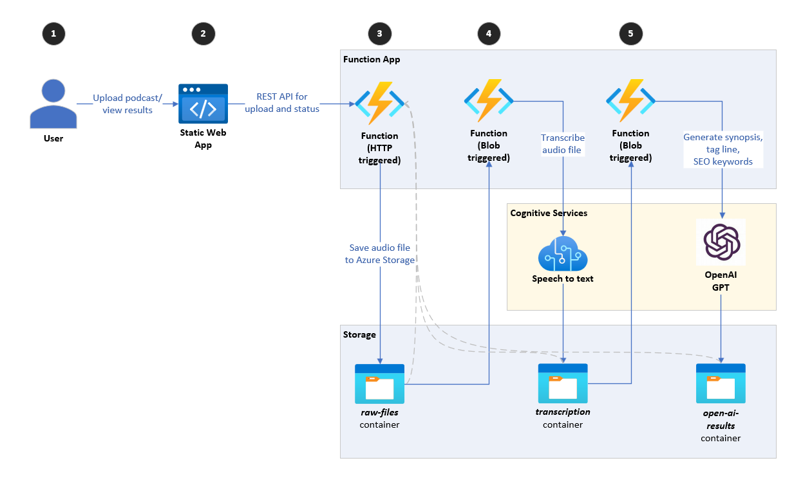

# Building a pipeline for processing media files using Azure OpenAI for analysis

## Overview

The process of podcast synopsis generation traditionally has required creators, producers, and/or writers to understand the content, and manually write the synopsis, summarizing the salient points and highlights of an episode. This approach is time-consuming and may involve brainstorming sessions that discuss the main themes, and refine the text until it effectively conveys the podcast's message and tone (e.g., a comedic podcast may feature humorous language or hyperbole in its summaries).

This repository illustrates how to automate a large part of this manual and time-consuming process using the portfolio of services provided by [Azure Cognitive Services](https://azure.microsoft.com/en-us/products/cognitive-services); specifically [Azure Speech Service](https://azure.microsoft.com/en-us/products/cognitive-services/speech-services/) and [Azure OpenAI](https://azure.microsoft.com/en-us/products/cognitive-services/openai-service) are used for transcribing and generating the **synopsis**, **taglines**, **SEO keywords** and **translation**. Incorporating AI to automate this process does not eliminate the role of human creativity or the importance of human involvement. Instead, it enables a significant acceleration in time-to-market by harnessing the power of AI. The final validation and approval of content remains the responsibility of human specialists before publishing.

## Architecture

This repository implements a high-level architecture that will take the audio of a podcast (steps 1-3), transcribe the audio into text using Azure Speech Services (step 4), and generate a synopsis based on the transcription using Azure OpenAI GPT-3.5 (step 5).

It consists of a React web app that allows a user to upload an audio file (podcast). The app uses an [Azure function (WebApiHttpTrigger)](/src/functions/WebApiHttpTrigger/) endpoint to upload the audio file to a storage account, i.e. the `raw-files` container.

[Azure function (AudioFileUploadedBlobTrigger)](./src/functions/AudioFileUploadedBlobTrigger/) get triggered when a new file is added to the `raw-files` container. The function downloads the audio file and sends it to Azure Speech Services and transcribes the audio to text. It then saves the transcription to the same storage account, i.e. the `transcription` container.

The last [Azure function (TranscriptionFileUploadedBlobTrigger)](./src/functions/TranscriptionFileUploadedBlobTrigger/), is triggered when new files are added to the `transcriptions` container. The function downloads the transcription file and sends it to four different Azure OpenAI methods that perform the following functions:

1. Generate synoposis
2. Generate tag lines
3. Generate SEO keywords
4. Generate synopsis translation in Mandarin Chinese, Brazilian Portuguese, German, and Latin American Spanish.

It saves the results as separate text files in the storage account `open-ai-results` container.

## Getting Started

1. [Infrastructure Deployment and Configuration](./docs/1-infrastructure-deployment.md)
2. [Local Development Setup](./docs/2-local-development-setup.md)
3. [GitHub workflows](./docs/3-github-workflows.md)

## Related Publications and Demo

- [Blog post with demo video](https://techcommunity.microsoft.com/t5/ai-cognitive-services-blog/automating-podcast-synopsis-generation-with-azure-openai-gpt/ba-p/3810308) for this solution.
- [Prompt design examples](https://github.com/Azure/azure-openai-samples/tree/main/use_cases/generate_podcast_synopsis) for this use case.

## Contributing

This project welcomes contributions and suggestions. Most contributions require you to agree to a Contributor License Agreement (CLA) declaring that you have the right to, and actually do, grant us the rights to use your contribution. For details, visit https://cla.opensource.microsoft.com.

To contribute, please start by creating a self-assigned issue giving a high-level overview of what you'd like to do. Once any discussion there concludes, follow up with a PR.

This project has adopted the Microsoft Open Source Code of Conduct. For more information see the Code of Conduct FAQ or contact opencode@microsoft.com with any additional questions or comments.
